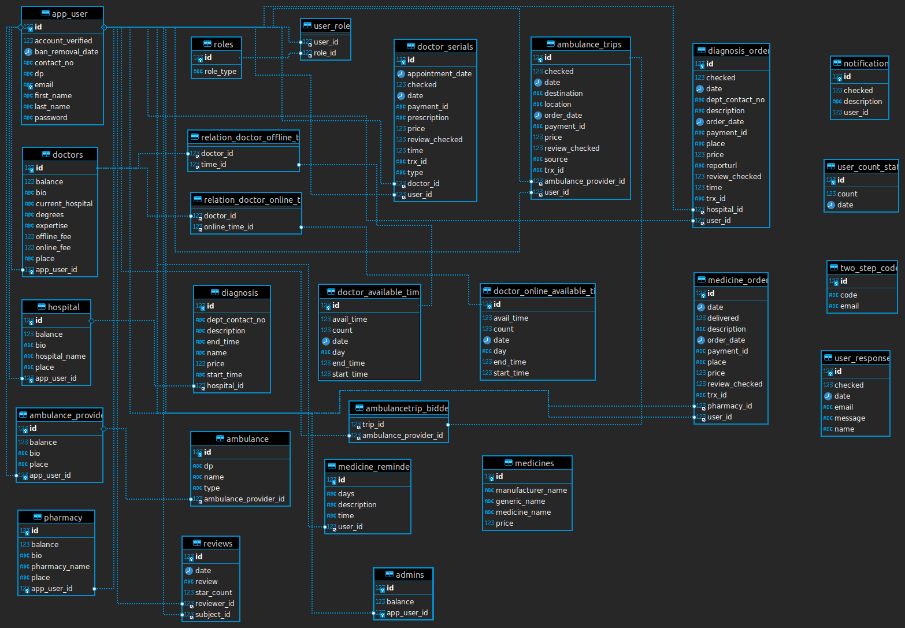

# HealTechBD Backend

## This is the spring boot Backend Server for Project HealTechBD.

## Features Used:

### 1. Sprint Boot Web
### 2. Sprint Boot Security
### 3. Sprint Data Jpa
### 4. Spring Boot Test
### 5. Spring Boot Scheduling
### 6. JWT Authentication & Authorization
### 7. Swagger
### 8. Model Mapper
### 9. Lombok
### 10. Maven
### 11. AOP(Aspect Oriented Programming)
### 12. OOP( Object Oriented Programming)

## Database:
### MySQL

## Database ER Diagram:

## API Documentation:

